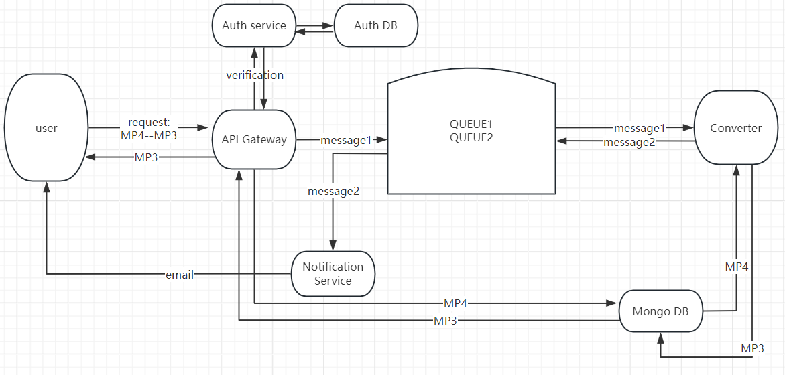
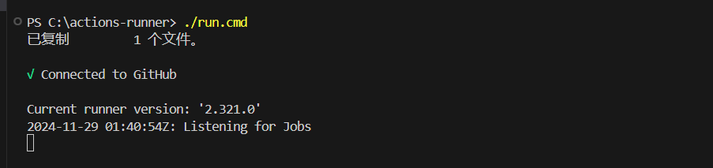

# Microservice

## Part 1: Workflow(from user perspective)

> The overall conversion flow is as follows:



1. **User upload**: when a user uploads a video to be converted to MP3, that request will first hit our gateway. Our gateway will then store the video in mongodb and then put a message on our rabbitmq queue. Downstream services know that there is video to be processed in Mongodb.
2. **Converting**: The video to MP3 converter service will consume messages from the queue. It will then get the id of the video from the message, pull the video from mongodb, convert the video to MP3, then store the MP3 on mongodb. then put a new message on the queue to be consumed by the notification service that says that the conversion job is done.
3. **Notification**: The notification service consumes those messages from the queue and sends an e-mail notification to the client informing the client that the MP3 for the video that he or she uploaded is ready for download.
4. **Downloading**: The client Then uses a unique ID acquired from the notification plus his or her JWT to make requests to the API gateway to download MP3. And the API gateway will pull the MP3 from mongodb and serve it to the client.

## Part 2: Services(from system design perspective)

> There are 5 micro-services in this architecture: auth service, gateway, converter, rabbitmq, and notification.

1. **Auth**: Handles user authentication and generates JWT tokens for secure API access.
2. **Gateway**: Acts as the entry point for all client requests, routing them to appropriate services and managing data storage/retrieval in MongoDB.
3. **Converter**: Processes video-to-MP3 conversion by retrieving videos from MongoDB, performing the conversion, and storing the resulting MP3s back in MongoDB.
4. **RabbitMQ**: Manages message queuing to coordinate workflows between services like conversion and notification.
5. **Notification**: Sends email notifications to clients when the MP3 conversion is complete and ready for download.

## Part 3: Steps to deploy(on local computer)

> If you're not interested in local deployment, skip this part.

1. Pre-intallations:
   Install these tools in your local computer, you can easily intall them by googling:
   1. Docker
   2. kubectl
   3. minikube
   4. python(see requirements.txt)
   5. k9s
2. Clone this github repo to your local environment
3. We will deploy this on teminal(mine is powershell):

   1. Activate python virtual environment:
      ```ps
      myvenv/Scripts/activate
      ```
   2. Deploy mysql statefulSet:
      ```ps
      kubectl apply -f ./python/src/mysql/manifests
      ```
   3. Deploy auth service:

      build the docker image and push it to dockerhub:

      ```ps
      docker build ./python/src/auth -t <example_dockerhub_username>/auth:latest
      docker push <example_dockerhub_username>/auth:latest
      ```

      if error happens in build step, try pull the image first:

      ```ps
      docker pull python:3.10-slim-bullseye
      ```

      if error happens in push step, try login docker first:

      ```ps
      docker login
      ```

      deploy the k8s service:

      ```ps
      kubectl apply -f ./python/src/auth/manifests
      ```

   4. Deploy mongodb statefulSet:
      deploy the k8s service:

      ```ps
      kubectl apply -f ./python/src/mongodb/manifests
      ```

      **initiate the mongodb statefulset:**

      1. enter mongodb shell

      ```ps
      kubectl exec -it mongodb-0 -- mongo
      ```

      2. run the rs.initiate() command with a configuration that lists all your pods:

      ```
      rs.initiate({
      _id: "rs0",
      members: [
         { _id: 0, host: "mongodb-0.mongodb.default.svc.cluster.local:27017" },
         { _id: 1, host: "mongodb-1.mongodb.default.svc.cluster.local:27017" },
         { _id: 2, host: "mongodb-2.mongodb.default.svc.cluster.local:27017" }
      ]
      })
      ```

      3. run "rs.status()" to verify the initiation.

   5. Deploy rabbit-mq service/statefulSet:
      configure host file:

      ```ps
      Add-Content -Path "C:\Windows\System32\drivers\etc\hosts" -Value "127.0.0.1 rabbitmq-manager.com"
      ```

      deploy the k8s service:

      ```ps
      kubectl apply -f ./python/src/rabbit/manifests
      ```

      add queues in rabbitmq gui: enter "rabbitmq-manager.com" in browser, input "guest" in both "username" and "password", then "Queues and Streams" - "Add a new queue" - "Type -- Classic" - "Name -- video" - "Add queue". add another queue named "mp3" the same way.

   6. Deploy consumer service:
      build the docker image and push it to dockerhub:

      ```ps
      docker build ./python/src/converter -t <example_dockerhub_username>/converter:latest
      docker push <example_dockerhub_username>/converter:latest
      ```

      deploy the k8s service:

      ```ps
      kubectl apply -f ./python/src/converter/manifests
      ```

   7. Deploy notification service:
      build the docker image and push it to dockerhub:

      ```ps
      docker build ./python/src/notification -t <example_dockerhub_username>/notification:latest
      docker push <example_dockerhub_username>/notification:latest
      ```

      deploy the k8s service:

      ```ps
      kubectl apply -f ./python/src/notification/manifests
      ```

   8. Deploy gateway service:
      build the docker image and push it to dockerhub:
      ```ps
      docker build ./python/src/gateway -t <example_dockerhub_username>/gateway:latest
      docker push <example_dockerhub_username>/gateway:latest
      ```
      configure host file:
      ```ps
      Add-Content -Path "C:\Windows\System32\drivers\etc\hosts" -Value "127.0.0.1 mp3converter.com"
      ```
      configure minikube addons and start minikube tunnel, this allows user to interact with gateway endpoint and rabbit-mq graphical interface from outside the k8s cluster(the Internet), the terminal process should stay alive to keep the tunnel accessible:
      ```ps
      minikube addons enable ingress
      minikube tunnel
      ```
      open a new terminal and deploy the k8s service(may need to deploy rabbitmq first):
      ```ps
      kubectl apply -f ./python/src/gateway/manifests
      ```

## Part 4: Steps to deploy(on AWS)

1. Configuring github actions

   1. Add a self-hosted runner and run it. The specific steps differ depending on the os on your local machine, mine window 10,x64. After you added and run, it should looks like this:

      

      You can refer to github official docs [here](https://docs.github.com/en/actions/hosting-your-own-runners/managing-self-hosted-runners/adding-self-hosted-runners)

   2. Add a workflow yaml file to your git repository, must be in this specific path:"repo_name/.github/workflows/workflow_name.yml". The workflow yaml file configures the runner, trigger-event of the workflow, and specifics about the whole process. [This is a quick start of writing a workflow](https://docs.github.com/en/actions/writing-workflows/quickstart).

2. Automating the deployment
   1. We can automate the whole deployment process by just pushing to the repository(it can be configured in the workflow yaml file).
   2. See the status of the workflow on the terminal of the self-hosted runner or github UI(repository-Actions)
3. Testing the deployment

See the original tutorial that I referred to [here](https://youtu.be/hmkF77F9TLw?si=zbVzVs1qiEza6g4v).
